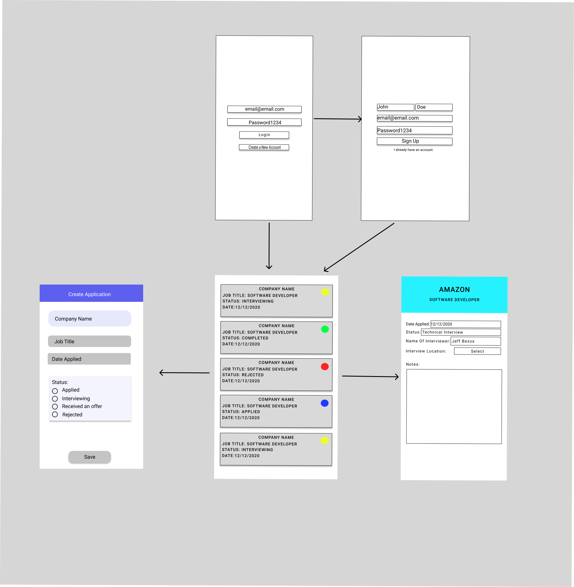

# Application Tracker

## Table of Contents
1. [Overview](#Overview)
2. [Product Spec](#Product-Spec)
3. [Wireframes](#Wireframes)
4. [Schema](#Schema)

## Overview
### Description
Application Tracker helps the user maintain a list of job applications and the status of the application. Users can add new applications, edit its details, and delete old applications. Users will have a list of all the applications with company name, job position, and status of application.

### App Evaluation
[Evaluation of your app across the following attributes]
- **Category:** Productivity
- **Mobile:** As a mobile app, it's easily accessible anytime.
- **Story:** I believe the app could be very useful. The benefit of having access to all your applications on your phone can help users stay in track with their applications.
- **Market:** Large market opportunity because software engineers can use this app repeatedly to track applications when they are searching for a job
- **Habit:** App is not habit-forming or addictive. An average user will primarily create, but they can also consume.
- **Scope:** The core of the project is simple and can be implemented. However, implementing some of the "stretch goal" features can be hard.

## Product Spec

### 1. User Stories (Required and Optional)

**Required Must-have Stories**

- [x] User can login/signup to Parse account
- [x] User can see dashboard of all applications (includes date applied, company name, and status of application (accepted, interviewed, rejected))
* User can add new application to dashboard
* User can edit or delete application entry

**Optional Nice-to-have Stories**

* User can navigate to detail view to see more information
    * User can add notes into notebox for each application
        * [Stretch-Stretch] User can add "update notes" to each application, with associated date/timestamp
* App persists application data locally for offline access
* User can filter applications by status
* User can filter applications by date applied
* User can search dashboard by keyword using search bar
* User can set dates/deadlines for each application and be sent a push notification to be reminded
* User can export all app data to CSV
* User can maintain "wishlist" of companies to apply to
* Dashboard view displays company logo fetched from website URL
* User can login with fingerprint/face ID
* User can open Google Maps to physical address of interview

### 2. Screen Archetypes

* Login
   * Users can login
* Register
   * Users can register
* Stream
   * Users can view a list of existing applications created
   * Includes date applied, company name, and status of application (accepted, interviewed, rejected)
* Creation
    * User can create a new application
    * User can edit the application
* Detail
    * User can view details of the application

### 3. Navigation

**Tab Navigation** (Tab to Screen)

* Logout
* Stream
* Creation

**Flow Navigation** (Screen to Screen)

* Login
   * stream
* Register
    * stream
* Stream
   * detail
* Creation
    * stream
* Detail
    * stream

## Wireframes
[Add picture of your hand sketched wireframes in this section]


### [BONUS] Digital Wireframes & Mockups

### [BONUS] Interactive Prototype

## Schema
[This section will be completed in Unit 9]
### Models
#### Application

| Property | Type | Description |
| -------- | -------- | -------- |
| Company Name | String | name of company |
| Date Applied | DateTime | date of application |
| Status     | int     | status of application     |
| Job Title     | String     | title of job     |
| Notes     | String     | any notes the user wants to add   |
| UserID     | String     | identifies user who made application (for networking requests) |


#### User

| Property | Type | Description |
| -------- | -------- | -------- |
| UserID | String | primary key |
| Email | String | user email |
| Password | String | user password |
| Name | String | name of user |


### Networking
#### Network Request Lists:

* Login Screen: 
    * (Read/GET) Get user profile information if logging in
    * (Create/POST) if user is registering

* Application List (Stream): 
    * (Read/GET): applications already created by user
    * (Delete) Delete existing applications

* Add Application (Create): 
    * (Create/POST) - create a new application

* Edit Application (Detail?): 
    * (Update/PUT) - user can change application details and add notes
    * (Delete) - user can delete application

- [Create basic snippets for each Parse network request]
- Login Screen - user login: (GET)
```
ParseUser.logInInBackground("username", "password", new LogInCallback() {
  public void done(ParseUser user, ParseException e) {
    if (user != null) {
      // take user to application page
    } else {
      // output the exception message as a long toast message
    }
  }
});
```
- Login Screen - user register: (POST)

```
ParseUser user = new ParseUser();
user.setUsername("username");
user.setPassword("password");
user.put("name", /*insert name*/);
user.signUpInBackground(new SignUpCallback() {
  public void done(ParseException e) {
    if (e == null) {
      // take user to the application list view
    } else {
      // output the parse exception as a long toast message
    }
  }
});
```
- Application List (Stream): (Read/GET): applications already created by user
```
// Define the class we would like to query
ParseQuery<ParseObject> applicationQuery = ParseQuery.getQuery("Application");
// Define our query conditions
query.whereEqualTo("owner", ParseUser.getCurrentUser());
// Execute the find asynchronously
query.findInBackground(new FindCallback<ParseObject>() {
    public void done(List<ParseObject> applicationList, ParseException e) {
        if (e == null) {
            // Access the array of results here
            String firstItemId = applicationList.get(0).getObjectId();
            //display the item
        } else {
            //log or toast the error
        }
    }
});

```

- Application List: (Delete) Delete existing applications

```
    //user clicks on application card - we can take the application object in the card and delete it
    application.deleteInBackground();
```

- Add Application (Create): (Create/POST) - create a new application

```
//have the application class inherit from parse object and use that instead
ParseObject application = new ParseObject("Application");
application.put("companyName", /*insert company name*/);
application.put("dateApplied", /*insert date*/);
application.put("status", /*insert status*/);
application.put("jobTitle", /*insert job title*/);
application.setOwner(ParseUser.getCurrentUser());
application.saveInBackground();
```

- Edit Application (Detail?): (Update/PUT) - user can change application details and add notes

```
ParseQuery<ParseObject> applicationQuery = ParseQuery.getQuery("Application");

// Retrieve the object by id
query.getInBackground(/*applicationID*/, new GetCallback<ParseObject>() {
  public void done(ParseObject application, ParseException e) {
    if (e == null) {
      application.put("status", /*insert status*/);
      application.put("notes", /*insert notes*/);
      application.saveInBackground();
    }
  }
});
```
- Edit Application:  (Delete) - user can delete application
```
    application.deleteInBackground();
```


- [OPTIONAL: List endpoints if using existing API such as Yelp]
- maybe using oauth?
